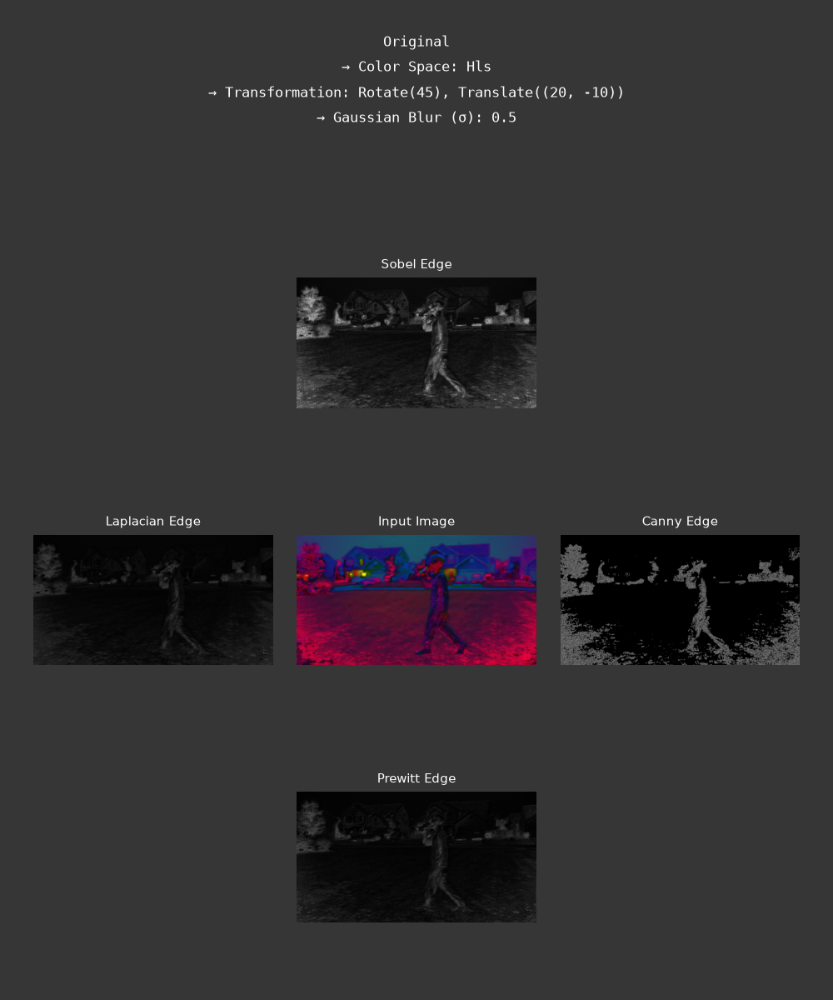
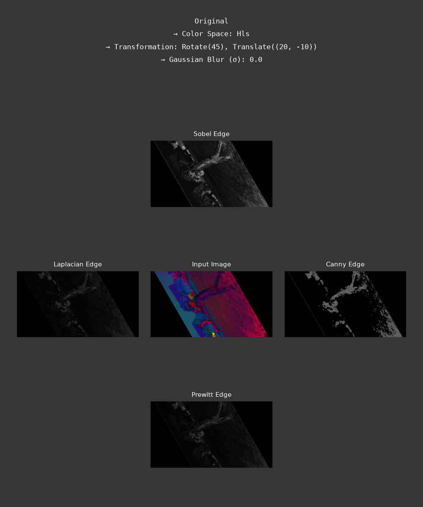
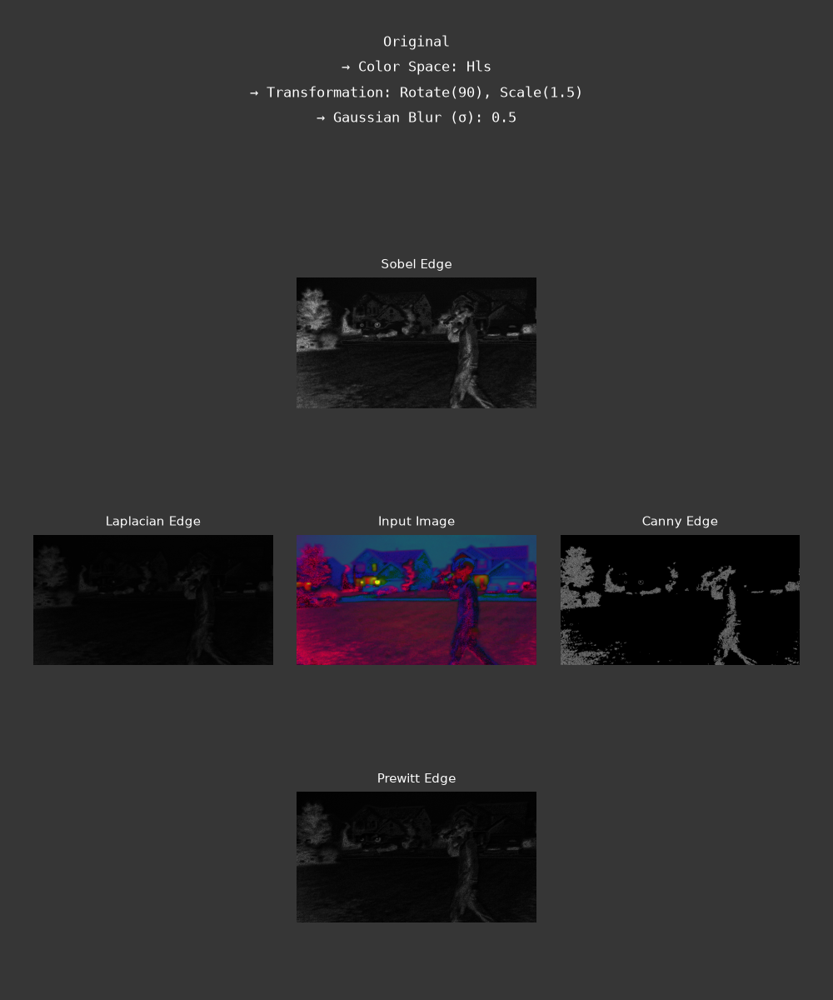
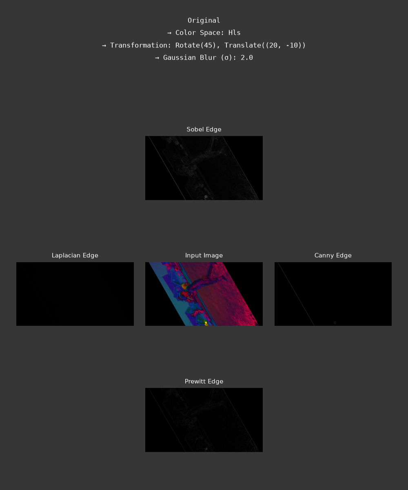
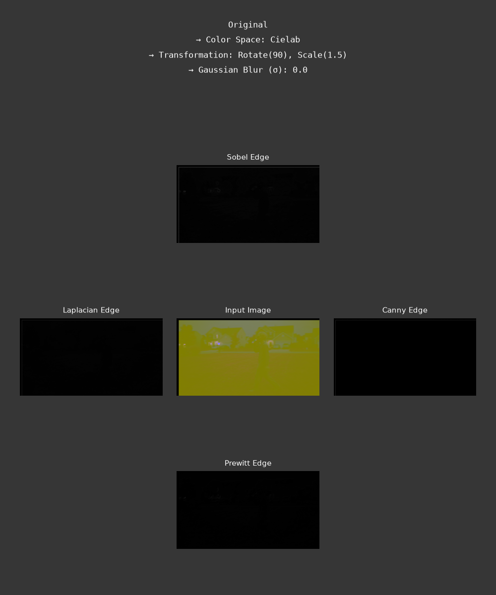
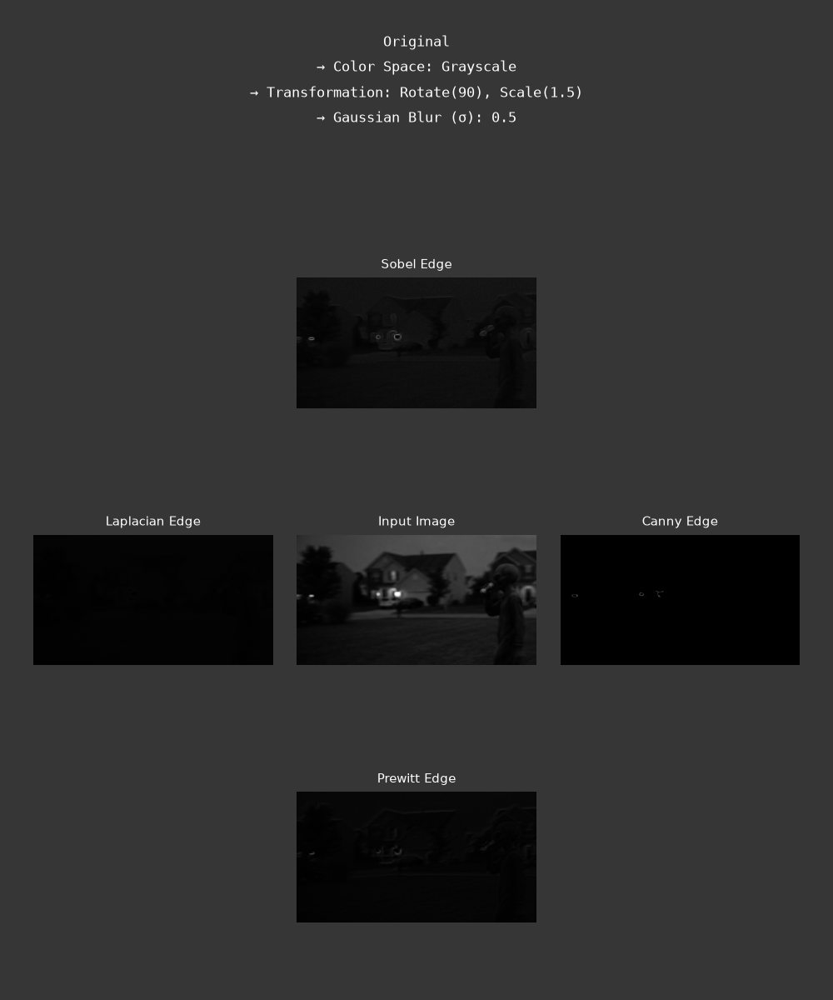

# Homework 1 & 2: Image Analysis and Computer Vision
**Course:** CS898BA

## Setup and Execution
1. Clone the repository.
2. Install all required Python and OpenCV libraries using the command:
   `pip install -r requirements.txt`
3. Run `python Project1.py` // `python Project2.py`

---
## Code Explanations

### Homework 1
#### Part 2
**Task 1**  
Explanation: Extracts individual color channel matrices and applies global statistical operators (np.min, np.mean, stats.mode, stats.skew) with axis=None to evaluate intensity distributions without altering array dimensions.

**Task 2**  
Explanation: Converts the input BGR image matrix into grayscale, HSV, CIELAB, and HLS representations using cv2.cvtColor to isolate specific visual features across different structural channel dimensions.

**Task 3**  
Explanation: Binarizes the grayscale image using Otsu's Thresholding via cv2.threshold, which automatically calculates the mathematically optimal intensity cutoff by maximizing inter-class variance between foreground and background pixels.

**Task 5**  
Explanation: Normalizes uneven scene lighting by isolating the brightness component (V channel) in the HSV color space, stretching its dynamic contrast range globally via cv2.equalizeHist before converting back to BGR.

**Task 6 & 7**  
Explanation: Applies 14 unique affine transformations across the 7 base images using custom 2x3 geometric transformation matrices (cv2.warpAffine) to introduce controlled spatial variations—such as midpoint rotations, directional translations, and horizontal shearing.

**Task 8**  
Explanation: Executes a multi-scale Gaussian Blur Sweep across 7 different standard deviation intensities (s = 0.5 to 3.5) using cv2.GaussianBlur with automatic kernel window sizing (ksize=(0,0)) to simulate progressive out-of-focus camera noise.

**Result discussion for Part 2, Task 8:**  
At low sigma values (0.5 to 1.0), minor background fuzz and small textures are cleaned up while keeping the main edges of objects sharp and clear so they are easy to find. On the other hand, at high sigma (1.5 to 3.5) values, the image is heavily blurred to wipe out fine details, leaving behind only large outlines which helps focus on the biggest shapes while ignoring background clutter.

#### Part 3
**Task 1 - 3**  
Explanation: Initializes a deterministic random seed (42) to shuffle the global image pool, ensuring reproducible results. The pool is then partitioned into four equal subsets of 42 images, with 'Subset 2' selected to serve as the active testing set for edge detection analysis.

**Task 4**  
Explanation: Performs multi-operator edge extraction on the active image subset. Implements Sobel, Laplacian, Canny, and Prewitt filters to convert grayscale intensities into high-contrast edge maps, capturing structural boundaries via spatial gradient calculation and thresholding.

**Task 6**  
Explanation: Iterates through the generated filter dictionary to write isolated edge-detected image arrays to the 'output_edges/' directory, utilizing standardized filenames for precise tracking and subsequent plotting retrieval.

**Task 8**  
Explanation: Constructs a 3x3 diamond-layout visualization for each image, embedding processing metadata (Color Space, Transformation, Gaussian Sigma) into a monospace header. Automates the generation of comparison figures and programmatically injects a random sample of 6 plots into 'README.md' for final reporting.

#### Part 3, Task 5 Discussion  
1. **Sobel**  
   * Pros: Fast and easy to use; provides a good balance between noise and edge detail.
   * Cons: Edges can appear thick, leading to less precise boundaries.

2. **Laplacian**
   * Pros: Very fast; excellent at finding rapid intensity changes.
   * Cons: Highly sensitive to noise, which often creates "false" edges. It also produces double-lined edges.

3. **Canny**
   * Pros: Generally the best; creates thin, clean, and accurate edges while filtering out noise.
   * Cons: More complex and computationally heavy than the others.

4. **Prewitt**
   * Pros: Very simple and fast for detecting horizontal or vertical lines.
   * Cons: Less accurate than Sobel and struggles with noise.

**Conclusion:** For this project, Sobel is the most effective all-around performer, providing the most consistent and usable edge maps. Prewitt serves as a strong secondary option, particularly for bright or high-contrast images where it offers a cleaner output by avoiding the excessive edge sensitivity seen in Sobel.

---

## Output Examples

### Homework 2
#### Part 2
The image is split into individual Blue, Green, and Red channels. Each channel is processed using cv2.equalizeHist to independently expand its contrast range. The channels are then merged back using cv2.merge to produce a normalized color image, which helps balance the overall brightness and visibility of the subject.

#### Part 3.1
This method isolates the foreground by converting the normalized image to grayscale, then applying Otsu’s thresholding for an automated global cutoff and Adaptive thresholding for local intensity adjustments that handle uneven lighting. Finally, cv2.bitwise_and(normalized_img, normalized_img, mask=mask) uses these masks to extract the foreground object from the original image.

#### Part 3.2
The normalized image is converted to HSV and reshaped into an (H*W, 3) floating-value array. cv2.kmeans is called for K = 3, 4, 5 with KMEANS_PP_CENTERS and attempts=10. After each call, the cluster indices are reordered by ascending centroid V (brightness) so cluster 0 is always the darkest and cluster K-1 is always the brightest—this ensures consistent labeling of the alien mask across different K values.

#### Part 4
The image is segmented using K-Means clustering, which starts by converting the input to the HSV color space and boosting the Value (V) channel to enhance contrast. After flattening the image into pixel data, the algorithm groups the pixels into K clusters—testing values between 3 and 5—and sorts them by brightness to ensure consistent labeling. Finally, the script generates a binary mask for the target cluster and uses cv2.bitwise_and to extract the figure from the normalized image.

#### Part 5.1
1. Otsu Thresholding
Advantage: 
- Provides an approach that effectively separates foreground from background without manual parameter tuning.
- Computationally efficient and works well if the scene is relatively bright.
Disadvantage:
- Struggles significantly with the uneven illumination of a doorbell camera.

2. Adaptive Thresholding
Advantage: Excels at handling local illumination variations by calculating thresholds for small image regions.
Disadvantage: Highly sensitive to image noise.

3. K-Means Clustering
Advantage: It is the best at isolating the figure as a solid piece by grouping similar colors and brightness together.
Disadvantage: Required to manually select the number of clusters (K).

#### Part 5.2
The ground truth image is self-drawn to serve as a reference, against which each generated mask is evaluated by loading them as grayscale images via cv2.imread and converting them to boolean arrays. These boolean masks are then compared using np.logical_and and np.logical_or to compute intersection and union areas, which are applied to standard arithmetic formulas to derive the IoU and Dice Coefficient, providing a precise quantitative accuracy score for each segmentation method.

#### Part 5.3
### Segmentation Comparison
